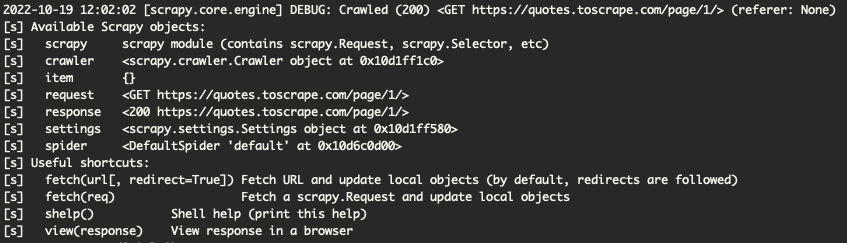

# 覚書
ドキュメント読み込みつつ、メモ程度に残しとく。

# tutorial
https://docs.scrapy.org/en/latest/intro/tutorial.html

## How to run our spider
```shell
# scrapy.cfgがあるディレクトリで叩くこと
scrapy crawl quotes
```

## Extracting data

scrapyのCLIを使うと、コードを記載しなくてもスクレピングまではやってくれるみたい。
```shell
scrapy shell 'https://quotes.toscrape.com/page/1/' 
```


最終的に利用可能なオブジェクト一覧が↑のように表示されるので、  
そいつに対してアクセスしたかったりしたら更にコマンドを叩いていくとよい。  
`response.css('title')`とか。

セレクタの指定とかはCSSの規定に則って記載すればOKで、  
返却値として`list[Selector]`型のものが返ってくる。


## XPath: a brief intro

xpathでも指定できる。返却される値はCSSと同じく`list[Selector]`型。

```
response.xpath('//title')
```

## Storing the scraped data

簡単にデータを出力したいなら`-O` or `-o`オプションを使って出力するのが楽。  
ItemPipelineを使うと、スクレイピング後のデータをゴニョゴニョできる。  

```shell
scrapy crawl quotes -O quotes.json
```

## Following links

cssセレクタで属性要素にアクセスしたいときは `attrib` を利用するとよい。
```
# href要素を取りたい時
response.css('li.next a::attr(href)').get()

# またはこんな感じでも指定できる
response.css('li.next a').attrib['href']
```


## Using spider arguments
パラメータは `-a` で指定できる。
```shell
# 実行例
scrapy crawl quotes -O quotes-humor.json -a tag=humor
```

プログラム中では `getattr`メソッドを使うとパラメータを取得ｄけいる。


